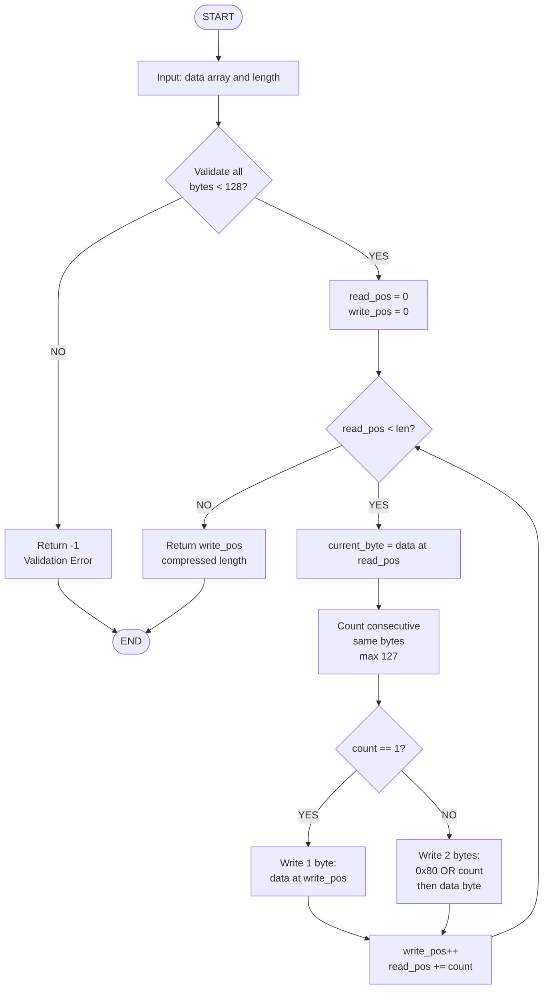
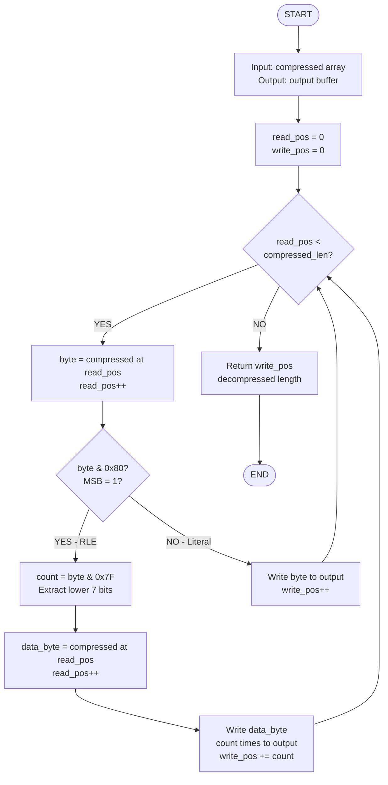
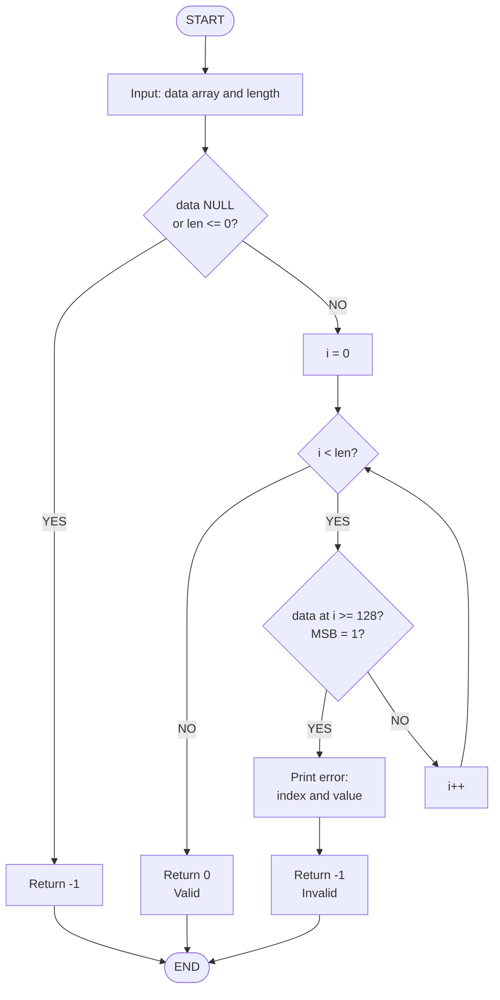
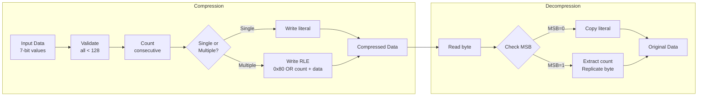
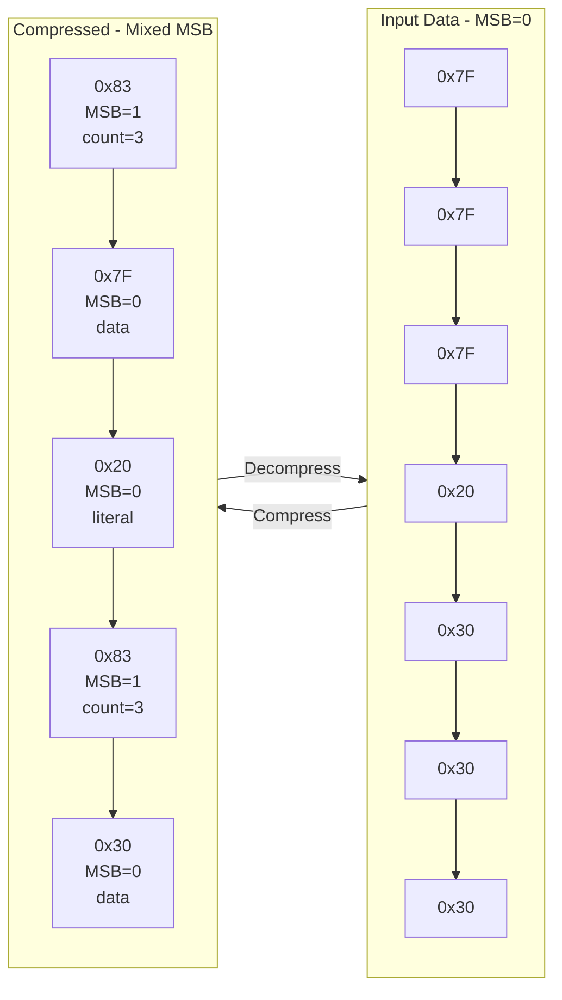
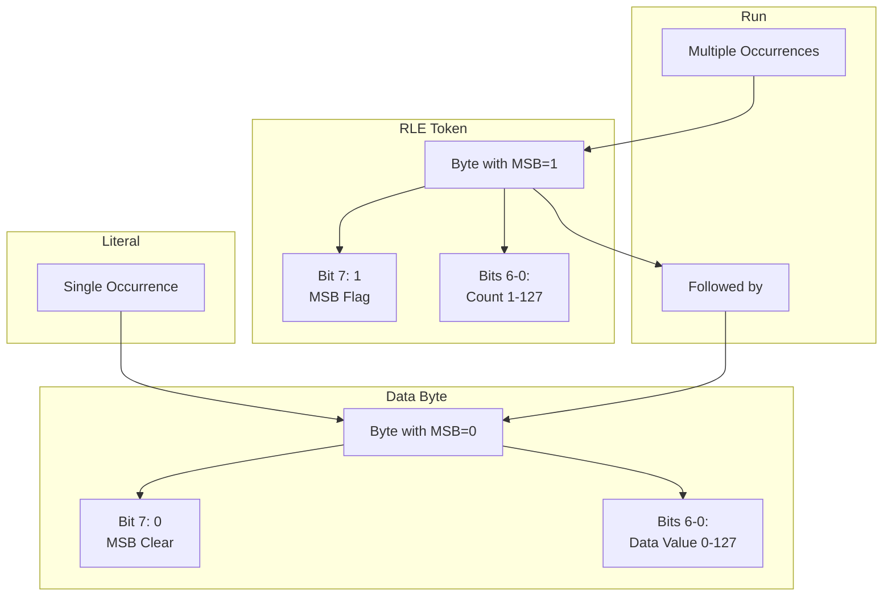
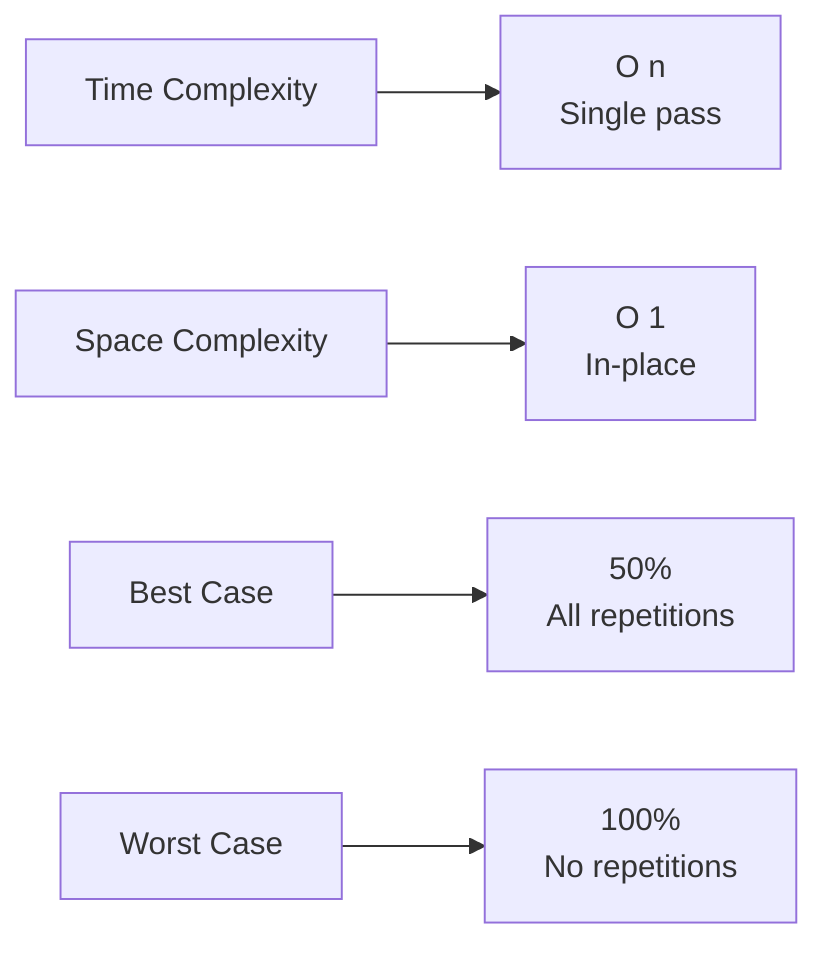

# Simple Compress Algorithm Flowcharts

## Compression Algorithm (simple_compress)

## Decompression Algorithm (simple_decompress)

## Validation Algorithm (simple_validate)

## Complete Process Flow

## Data Encoding Visualization

## Binary Format Diagram

---

## How to View These Diagrams

### In VS Code:
1. Install **Markdown Preview Mermaid Support** extension
2. Open this file and press `Ctrl+Shift+V` (or `Cmd+Shift+V` on Mac)
3. View rendered Mermaid diagrams

### Online:
1. Copy any diagram block
2. Paste into [Mermaid Live Editor](https://mermaid.live)
3. View and export as SVG/PNG

### In Documentation:
- GitHub automatically renders Mermaid diagrams
- GitLab supports Mermaid natively
- Many documentation tools support Mermaid

---

## Algorithm Complexity

